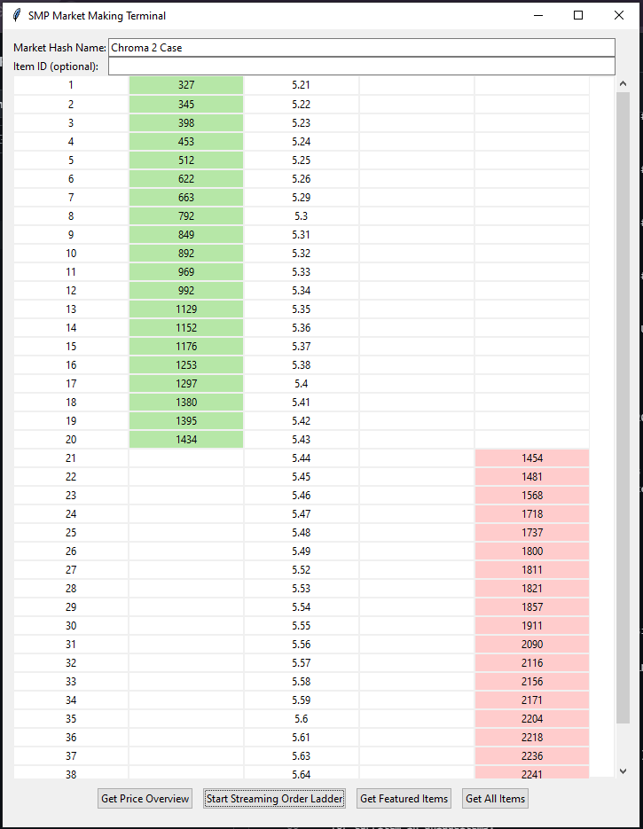

# CS2 Market Making Engine
The goal of this project is to create a market-making panel that uses C++ to calculate a fair value estimate for a given item in steam marketplace. This could further be used to create a model that effectively prices illiquid marketplace items in such a
way that maximizes profit, whilst providing an opportunity to find arbitrage opportunities in the process of calculation.

Here is an example image of the order ladder (currently missing the fair value estimate) of an extremely liquid Chroma 2 case in CS2. 


# Setup
Use pip to install requirements via
  ```pip install -r requirements.txt```
Add API keys under `keys/` directory
